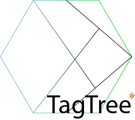

# TagTree



TagTree is a useful package that provides you to write and generate markup files using Python with a Component like structure. You can generate entire markup files like xml or html from automatic tasks.
The package source code is available on [this github repo](https://github.com/Strovsk/pytagtree)

# Install
    pip install tagTree

# Get-started
A basic example of an html file
```python
from tagTree import Tag

lineLen = 50
indentSize = 2

documentIndentation = 2
documentMaxLen = 90

# Create a doctype tag
doctype = Tag('!DOCTYPE', 'doctypeId', ['html'], documentMaxLen, documentIndentation, '', True, True)

#  Create a html tag
htmlTag = Tag('html', 'htmlId', [('lang', 'pt-br')], documentMaxLen, documentIndentation, '', True, True)

#  Create a head for our html document
head = Tag('head', 'headId', [], documentMaxLen, documentIndentation, '', True, True)

#  Create a script for our html document
scriptTag = Tag('script', 'scriptId', [('src', './js/myscript.js')], documentMaxLen, documentIndentation, '', False, False)

# Insert the script into head tag
head.push(scriptTag)

#  Create a body for our html document
body = Tag('body', 'bodyId', [], documentMaxLen, documentIndentation, '', True, True)

# Insert the body and head tags inside html
htmlTag.push(head)
htmlTag.push(body)

#  Create an title for our html page
h1 = Tag('h1', 'hId', [], documentMaxLen, documentIndentation, 'This is page created from TagTree', True, True)

#  Create a short description for our html page
p = Tag('p', 'pId', [], documentMaxLen, documentIndentation, 'This is a pargraph', True, True)

# Create a button tag
button = Tag(
    tagName = 'button',
    id = 'mainTagId',
    params= [
        ('buttonParam', 'paramValue'),
        ('anotherButtonParam', 'anotherParamValue'),
        'disabled'
    ],
    maxLenLine = documentMaxLen, # 200 characteres
    indentation = documentIndentation, # indendation size in spaces
    innerText = 'click me'
)

# Insert the h1, p and button tags into body
body.push(h1)
body.push(p)
body.push(button)

print(doctype.genContent())
print(htmlTag.genContent())
```
The Output will be a formatted string:
```html
<!DOCTYPE html>
<html lang="pt-br">
  <head>
    <script id="scriptId" src="./js/myscript.js" />
  </head>
  <body>
    <h1>This is page created from TagTree</h1>
    <p>This is a pargraph</p>
    <button
      id="mainTagId"
      buttonParam="paramValue"
      anotherButtonParam="anotherParamValue"
      disabled
    >
      click me
    </button>
  </body>
</html>
```

# Usage

## The default Tag
By default, all tags need an id and it'll appears in final content, but you can hide it at final result. All tags are also self-closed.

```python
from tagTree import Tag

myTag = Tag(
    tagName = 'button',
    id = 'mainTagId',
    params = [
        ('buttonParam', 'paramValue'),
        ('anotherButtonParam', 'anotherParamValue'),
        'disabled'
    ],
    maxLenLine = 200, # 200 characteres
    indentation = 2, # indendation size in spaces
)

print(myTag.genContent())
```

The output will looks like:

    <button id="mainTagId" buttonParam="paramValue" anotherButtonParam="anotherParamValue" disabled />

To understand the basic params used in the first example:
- `tagName`: the name of tag.
- `id`: the tag id.
- `params`: a list of tag params that can be passed like a tuple/list `(param, value)` or only string `'param'`.
- `maxLenLine`: the max size of generated tag string. If the size is greater than max value, the tag will be replaced to fill right size.

There are more tag props, you can see then [tag props section](#tagParams)

# Inserting tags

The tags have a parent-child system. So, you can push or pop childrens from parent tag. See the example:
```python
from tagTree import Tag

parentTag = Tag(
    tagName = 'div',
    id = 'parentId',
    params = [('class', 'buttonContainerDiv')],
    maxLenLine = 200, # 200 characteres
    indentation = 2, # indendation size in spaces
)

childTag = Tag(
    tagName = 'button',
    id = 'childId',
    params = [
        ('onClick', 'foo();'),
        ('type', 'button'),
        'disabled'
    ],
    innerText = 'Click me',
    maxLenLine = 200, # 200 characteres
    indentation = 2, # indendation size in spaces
)

parentTag.push(childTag)

print(parentTag.genContent())
```
The Output:
```html
<div id="parentId" class="buttonContainerDiv">
  <button id="childId" onClick="foo();" type="button" disabled>Click me</button>
</div>
```

<h1 id="tagParams">Tag props</h1>

- `tagName`:
    - description
        - The tag name
    - default: None
    - type: string
    - example
        - `'button'`, `'MxCell'`
- `id`:
    - description
        - The tag Id
    - default: None
    - type: string
    - example
        - `'myTagId'`
- `params`:
    - description
        - A list with all tag parameters that can be tuples/lists with `(param, value)` model or simple string `param`
    - default: None
    - type: list
    - example
        - `[('type', 'button'), 'disabled', ('onClick', 'foo();')]`
- `maxLenLine`:
    - description
        - The max length of generated line
    - default: None
    - type: int
- `indentation`:
    - description
        - The size of indentation in spaces
    - default: 2
    - type: int
- `innerText`:
    - description
        - The inner text value of tag
    - default: ''
    - type: string
- `noSlashAtEnd`:
    - description
        - If true, show '>' at end of self-closed tags instead '/>'
    - default: False
    - type: bool
- `hideId`: False
    - description
        - If true, remove the id from tag params at final result
    - default: False
    - type: bool
